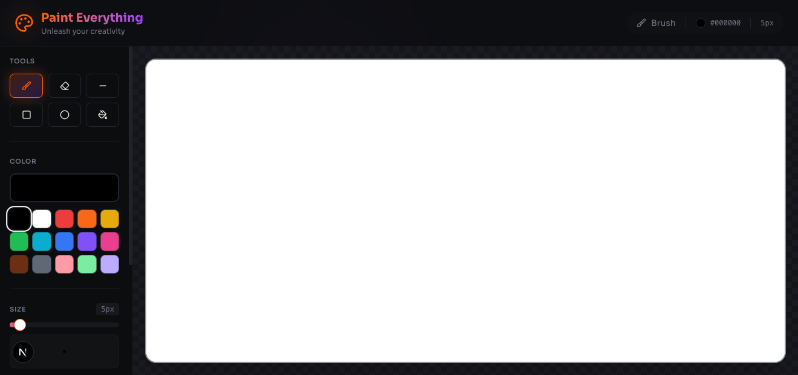
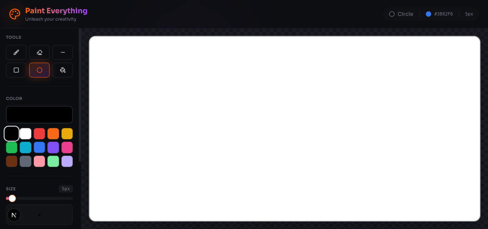

# 🎨 Paint Everything

A beautiful, feature-rich digital painting application built with Next.js, React 19, TypeScript, and shadcn/ui.



## ✨ Features

### 🖌️ Drawing Tools
- **Brush** - Freehand drawing with customizable size
- **Eraser** - Remove painted areas
- **Line** - Draw straight lines
- **Rectangle** - Draw rectangles and squares
- **Circle/Ellipse** - Draw circles and ellipses
- **Fill (Paint Bucket)** - Flood fill enclosed areas with color



### 🎨 Color Controls
- Full color picker supporting any color
- 15 preset colors for quick access
- Live color preview in the toolbar
- Current color displayed in the status bar

### 📏 Brush Size
- Adjustable size from 1px to 100px
- Visual size preview showing current brush
- Gradient slider with smooth controls

### ⚡ Actions
- **Undo/Redo** - Up to 50 history states
- **Clear Canvas** - Start fresh with a blank canvas
- **Save Image** - Download your artwork as PNG

### ⌨️ Keyboard Shortcuts

| Shortcut | Action |
|----------|--------|
| `B` | Brush tool |
| `E` | Eraser tool |
| `L` | Line tool |
| `R` | Rectangle tool |
| `C` | Circle tool |
| `F` | Fill tool |
| `⌘/Ctrl + Z` | Undo |
| `⌘/Ctrl + Shift + Z` | Redo |
| `⌘/Ctrl + S` | Save image |

## 🚀 Getting Started

### Prerequisites
- Node.js 18+ or Bun

### Installation

```bash
# Clone the repository
git clone <your-repo-url>
cd paint_everything

# Install dependencies
bun install
# or
npm install

# Run the development server
bun dev
# or
npm run dev
```

Open [http://localhost:3000](http://localhost:3000) with your browser to start painting!

## 🛠️ Tech Stack

- **Framework**: [Next.js 16](https://nextjs.org/) with App Router
- **Language**: TypeScript
- **UI Components**: [shadcn/ui](https://ui.shadcn.com/)
- **Styling**: Tailwind CSS 4
- **Icons**: Lucide React
- **React**: React 19

## 📁 Project Structure

```
paint_everything/
├── app/
│   ├── components/
│   │   ├── PaintCanvas.tsx   # Canvas with drawing logic
│   │   └── Toolbar.tsx       # Sidebar with tools and controls
│   ├── globals.css           # Global styles and theme
│   ├── layout.tsx            # Root layout
│   └── page.tsx              # Main page
├── components/
│   └── ui/                   # shadcn/ui components
├── lib/
│   └── utils.ts              # Utility functions
└── public/                   # Static assets
```

## 🎯 How to Use

1. **Select a Tool** - Click on any tool in the toolbar or use keyboard shortcuts
2. **Choose a Color** - Use the color picker or click a preset color
3. **Adjust Size** - Use the slider to change brush/shape size
4. **Draw** - Click and drag on the canvas to create your artwork
5. **Save** - Click the download button to save your masterpiece as PNG

## 📄 License

MIT License - feel free to use this project for learning or building your own applications!

---

Made with ❤️ using Next.js and React
